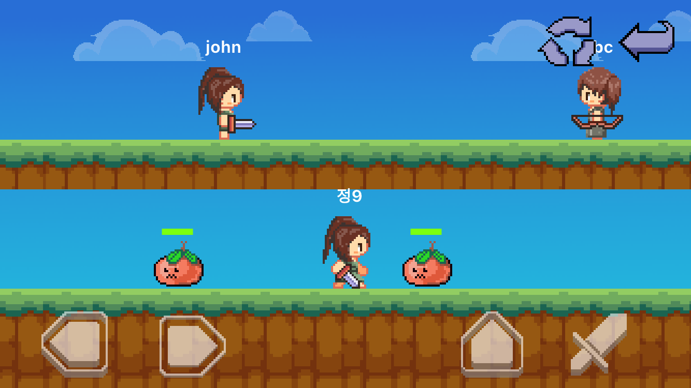
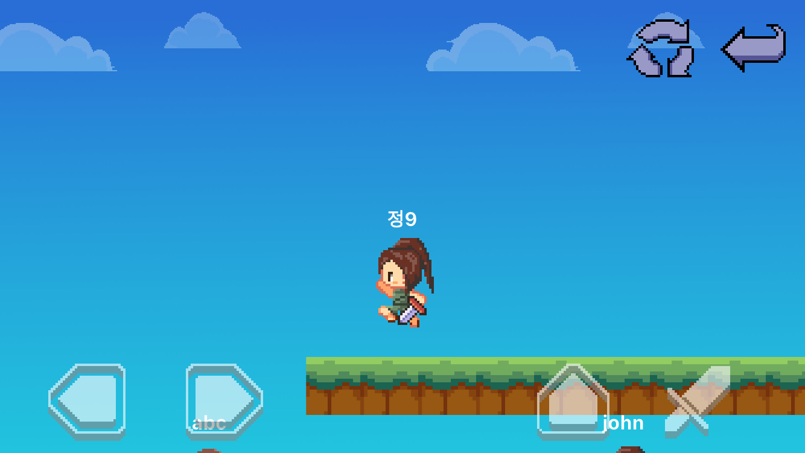
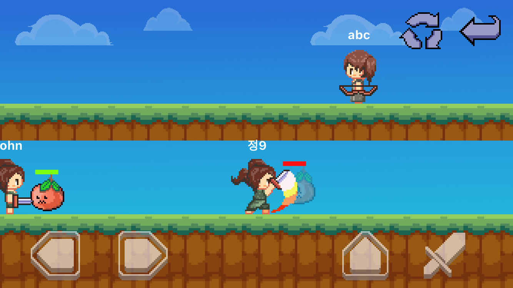
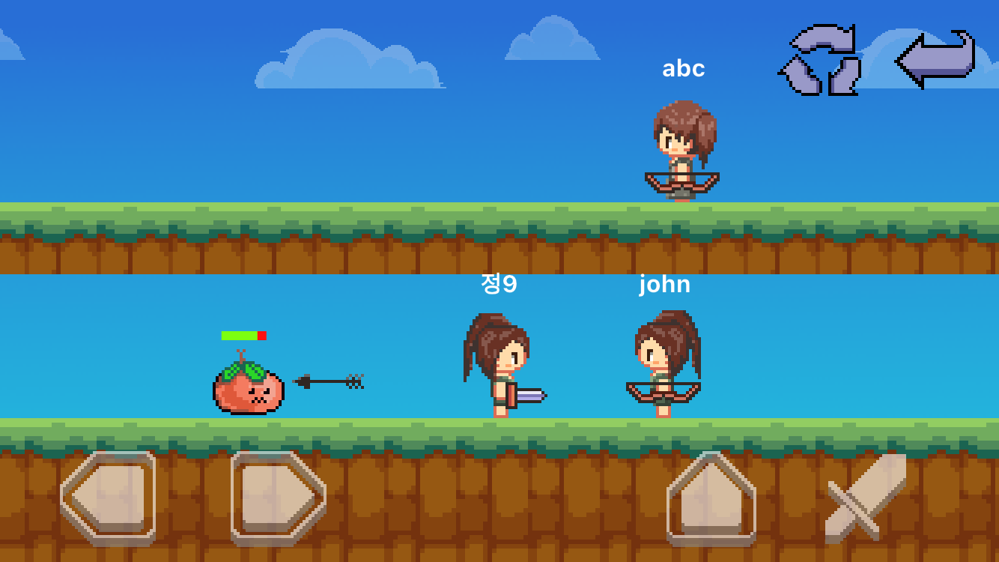
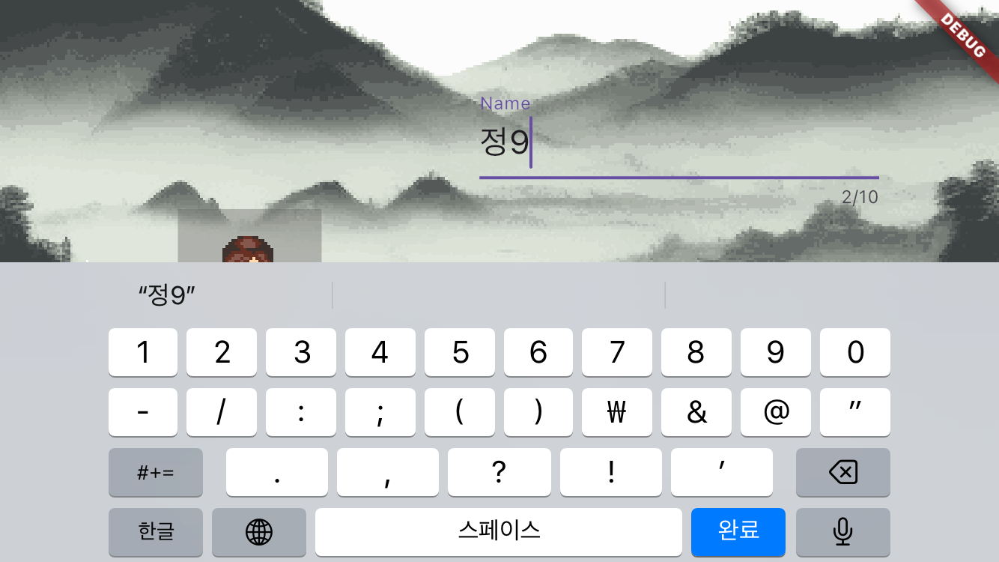

# tsoh

The Story of Hallakungui.

# About

2D RPG game with optional multiplay.

# Screenshots








# Features

- multi scene management using worldroute
- camera moving
- 2 type clothes and weapon swap
- collision check with ground tile
- strike enemies with swords and arrows
- overlay
- localization
- connecting to a server using http and websocket
- bgm and audio effect

# Technologies

- [Dart](https://dart.dev/)
- [Flutter](https://flutter.dev/)
- [Flame Engine](https://flame-engine.org/)
- [Dart Frog](https://dartfrog.vgv.dev/)

# Starting

- Launch iOS simulator or Android emulator and set landscape orientation.
```bash
$ git clone https://github.com/ecli666/tsoh
$ cd tsoh
$ flutter pub get
$ flutter run
```
- For multiplay.
```bash
$ git clone https://github.com/ecli666/tsoh
$ cd tsoh
$ cd server
$ flutter pub get
$ dart_frog dev
$ cd ..
$ flutter pub get
$ flutter run
```

# License

- This project is under license from MIT.
